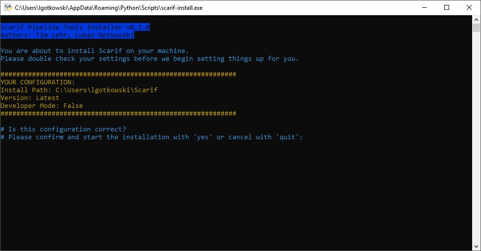

# Install Instructions

## Requirenments
To use the Scarif Pipeline Tools a Windows, Linux or Mac machine with python 2.7.x with pip is required,
as well as MySQL server to run host the database.

## Download & Install
### Download and install the scarif-install package
Make sure either your environment variable for "pip" is set or go to the pip.exe directory inside your 
python 2.7.x directory. Then execute the install command.

Install command: `$ pip install scarif-install --user`

This will download and install the "scarif-install" package to the python user folder as well as
create the scarif-install.exe in the "Python/Scripts/"  user directory.

### Install Scarif using the scarif-install package
Now you can either install Scarif in the normal mode or in the development mode,
using the "scarif-install.exe" in yout users python scripts folder.

- Normal: Simply run the "scarif-install.exe" file and follow the instructions.
- Development: Execute the "scarif-install.exe" file using the following python command: `$ scarif-install -d path/to/the/scarif/development/reposetories/`

Pip will automatically install all additional requirements.

If you do not plan to do development on the machine you are currently installing, we highly recommend using
the normal mode for installation.

When the install process has finished the Scarif Hub should launch automatically from where you can start to create new 
or add existing projects.

Before you can start, you need to make sure your team already has a mysql server up and running to be able to host the
Scarif database.

### Scarif Install Directory:
Default install directory. Usually you should not have to do anything there.
- Windows: ``%USERPROFILE%\Scarif``
- Linux: ``~/Scarif``
- Mac: ``~/Scarif``

Inside the Scarif install directory you can find the **Scarif Core Environment** (core_env) as well
as all the **Project Environment** 's (_python_env) located inside the projects directories.
