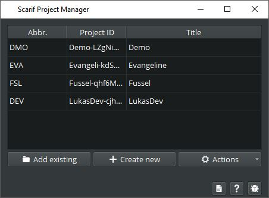
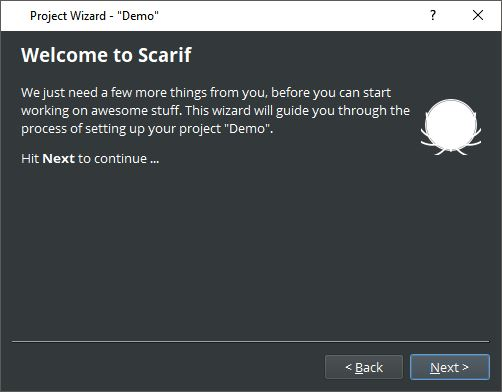
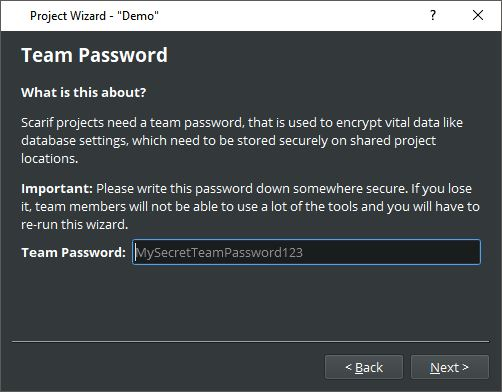
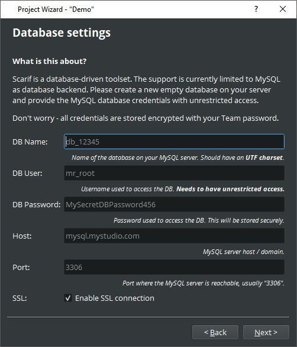
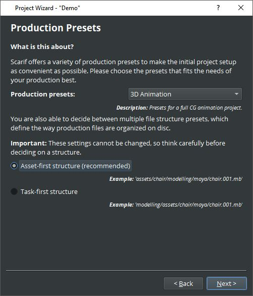
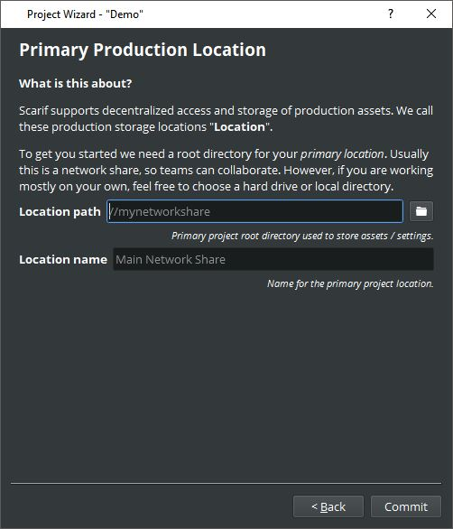
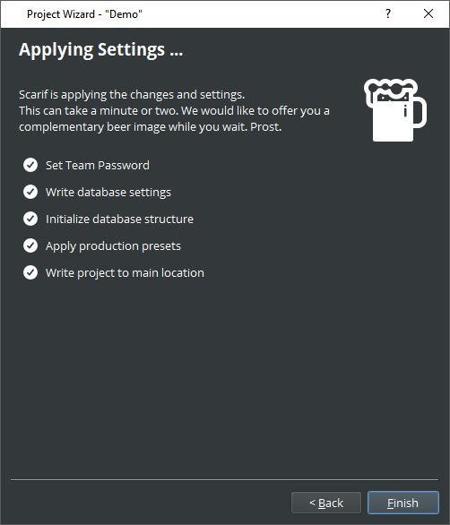
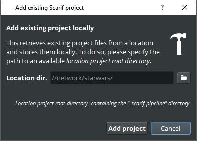
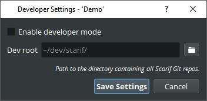
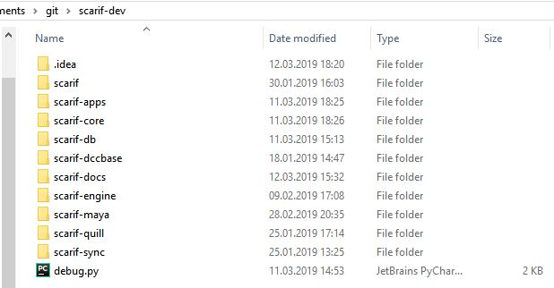

# Project Manager
The project manager is used to add, remove and edit projects. You can configure your team passoword here as well 
as setup developer options.

## Create a new project
To create a new project go to the Scarif Hub and click on "Projects". The Scarif Project Manager will open. From there
click "Create new"

Follow the project setup instructions from the project manager. When finished the project should be listed.
Next step is to configure the newly created project.

Select the project in the list go to "Actions" and select "Setup Wizard". Follow the setup instructions.
During the process you will be asked to provide information about the mysql server as well as a location
where the project data, like assets and shots, should be stored.

Important: Remember the team password you create.

Guided instructions... 

>Next Steps:
>- [Add users](./05_usersetup.md) 
>- [Setup applications (Maya, Houdini, Nuke etc)](./06_applicationsetup.md) 

## Add an existing project
Adding an existing project is very simple. Just click "Add existing" and navigate to the projects root directory,
it is the parent directory of the "_scarif_pipeline" folder.

## Using a project in development mode
Select a project, go to "Actions" and hit "Dev Settings". Simply set the path to the location where you downloaded 
all the scarif reposetories and enable the checkbox.
Afterwards you have to open the Package mMnager from the hub and reinstall the packages you want to use for development.

_(Example development setup for the scarif repositories)_
 