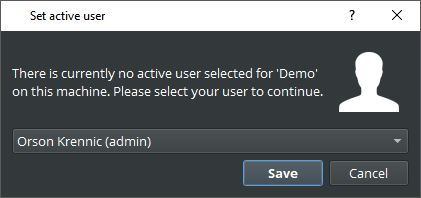
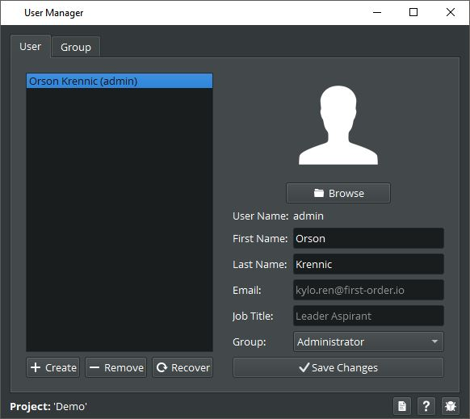
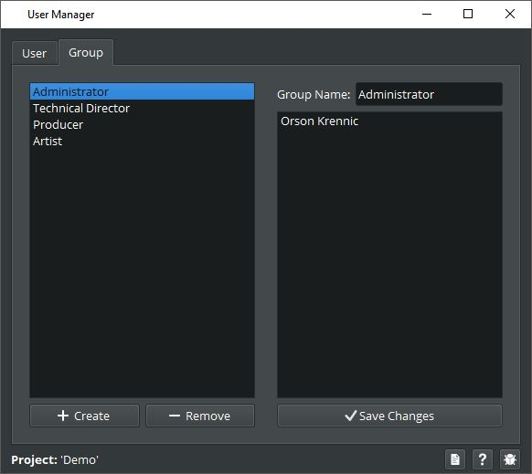

# User Manager
Creating and editing user and groups can be done with the user manager.

Each team member should have its own user account. This is important as each user can
have different task assignments in the project or have different settings for his or her applications.
Open the hub and from there under "Your Project Name"->"Managers"->"User"

Important: 
- Users exist per project. So if you are working on multiple projects you need to create a user for each of the projects.

- Make sure after installing the pipeline on a new machine to switch the user to the one who is working on that
machine to prevent confusion. Each team member should always use his or her own scarif user. 
(The default active user "Orson Krennic" should always be changed to the correct user)

(The active user can be switched in the hub under "Your Project Name"->"Managers"->"Switch Active User")

In Addition to creating users you can also create new groups for managing them. Usually the four default groups are fine.

