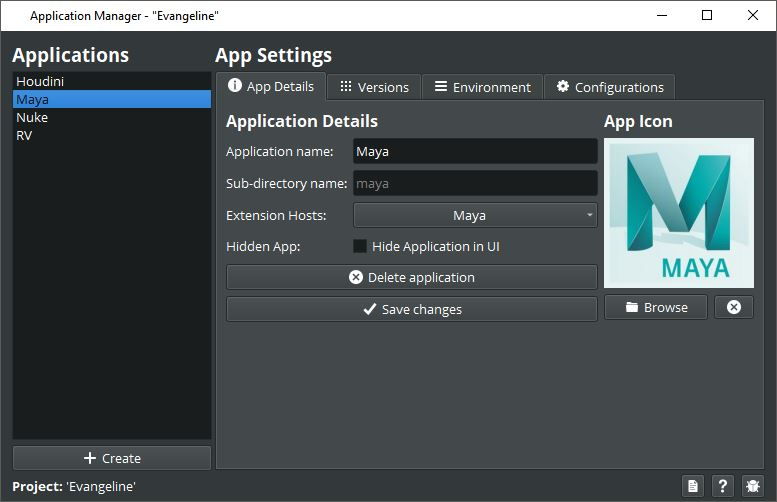
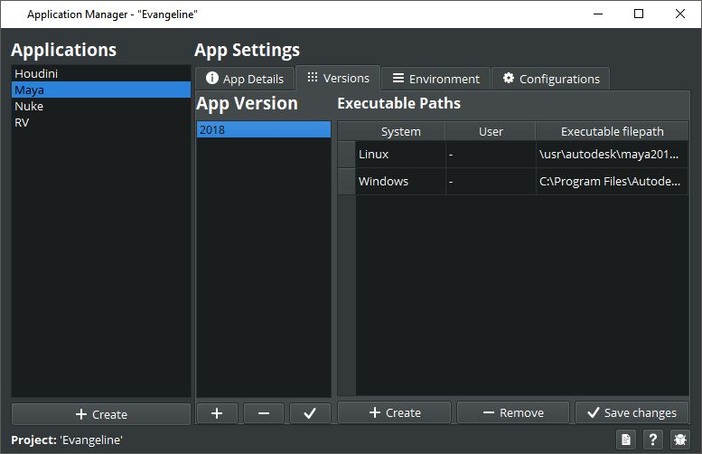
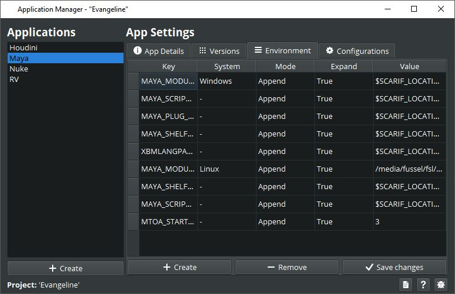
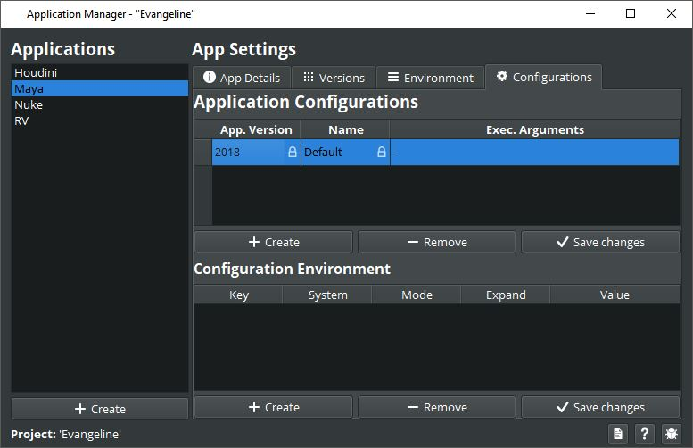

# Application Manager
The application manager helps you to setup all your DCC for the projects. 

When working in a team on a project you usually want to configure your applications to for example
providing the location where the software is installed. Maybe configure different versions of the same software
as well as setup some environment variables and so on. 

Most of the bigger applications like Maya, Houdini and Nuke come with their own scarif package. Before you
can correctly configure them you have to install the packages using the [Package Manager](./09_packages.md)
who you can find in the hub menu. 
Make sure to install the packages for the correct project and not for the scarif core.

