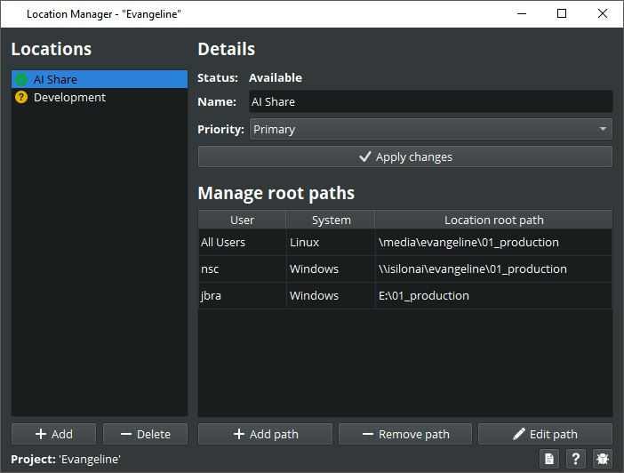

# Location Manager
Specify the locations where your project data is stored. Each project can have more then one location to store assets.
The path to the location can be configured for all users at once while being able to have different configuration for 
individual users or plattforms.

