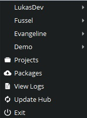

# Scarif Hub
The Scarif Hub is the entry point for all your pipeline related project work. You will 
manage [Projects](./04_projectsetup.md), [Users](./05_usersetup.md), [Locations](./07_locationsetup.md) and additional installed scarif 
[Packages](./09_packages.md). 
It is also the place from where you will launch all your DCC applications like Maya, Houdini, Nuke etc. after they have 
been configured using the [Application Manager](./06_applicationsetup.md). 

The hub will update itself from time to time and notify you, if any further action is required.

If something went wrong you can always check out the [Logs](./12_logger.md).

 
