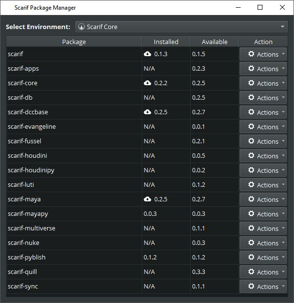

# Package Manager
Scarif is divided into many different packages. Each package has its very specific perpouse. 

There two packages which are installed for the hub (into the _scarif core environment_):
- scarif
- scarif-core

And three packages which are always installed for each project (Project Environment):
- scarif-core
- scarif-db
- scarif-apps

Each of the DCC's like Maya, Houdini, Nuke etc. comes with its own package which needs to be installed using the 
package manager. Once installed for a project it will automatically be installed on other machines where scarif is 
installed and which are connected to the project.

Extensions:
- scmaya (Maya)
- schou (Houdini)
- scnuke (Nuke)
- scsync (FTrack)
- scengine (Unity)
- scquill (Quill)
 
 
 > Important: When installing a new package make sure to select the correct environment.
 
 