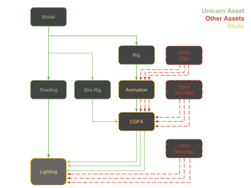
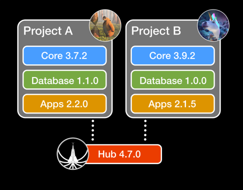

# Technical Guide
This guide is for all technical people who want to know how scarif is working under the hud without going into code .
It explains a bit the technical structure of scarif where files are located, how the individual projects are handled 
and how to trouble shot cases where things did not go as intended.

## Department Workflow
This graphic illustrates how data flows through the different departments. Each department works on its own tasks,
it can hast its onw inputs and outputs. Inputs ar published files from other tasks while the output is the publish of 
the current task. This way assets and shots can easily be assembled and decomposed.

In this example the asset of a "Unicorn" is used.

## Handling Scarif Versions
While the hub will always be installed in only one specific version, each project and its packages can be installed in 
different versions. This can be managed using the [Project Manager](./04_projectsetup.md)

